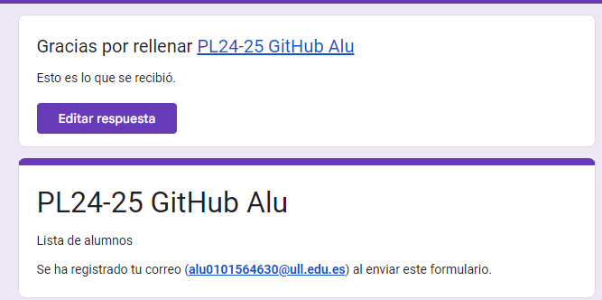
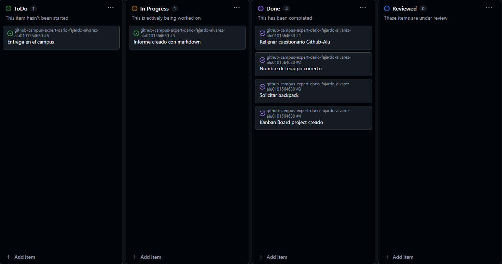
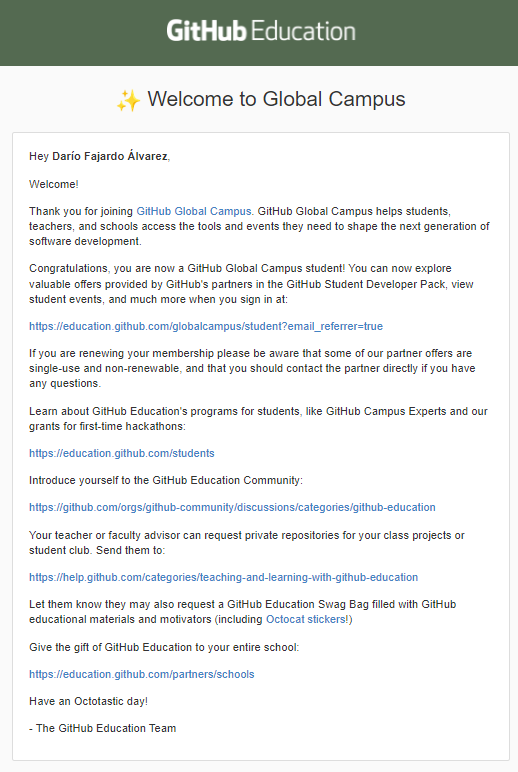

# [Github Campus Expert](https://apuntes-pl.vercel.app/labs/github-campus-expert) 

- Darío 
- Fajardo 
- alu0101564630

## Rellenar el [cuestionario GitHub-Alu](https://docs.google.com/forms/d/e/1FAIpQLSd7Ee2dW5AqOepKJmznjh1TDCoaNNUbo8adrk-rxYHNJwK1GA/viewform) del campus virtual y recibir el correo confirmándolo

## Crear equipo con nombre correcto

## Crear un project board kanban para este repositorio

## Solicitar el GitHub Backpack

## Resumen de tareas

| Tarea | Descripción |
|-------|-------------|
| Cuestionario | Realizar el cuestionario Github Alu del campus con nuestra información de github |
| Aceptar tarea | Aceptar la tarea relacionada con esta práctica y crear el equipo individual en la organización de la asignatura siguiendo las pautas indicadas para el nombre |
| Solicitar Backpack | Solicitar el Github Student Pack si no se dispone ya de él |
| Crear Kanban board | Crear una tabla kanban en el proyecto de esta práctica para marcar las tareas realizadas y el progreso de la práctica |
| Informe | Crear este informe, describiendo y demostrando el trabajo realizado en la práctica |
| Entrega en el campus | Entregar el .zip con el repo de la práctica en la tarea pertinente del campus virtual |
